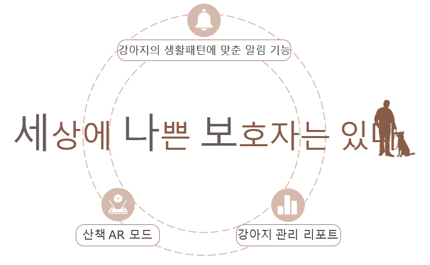
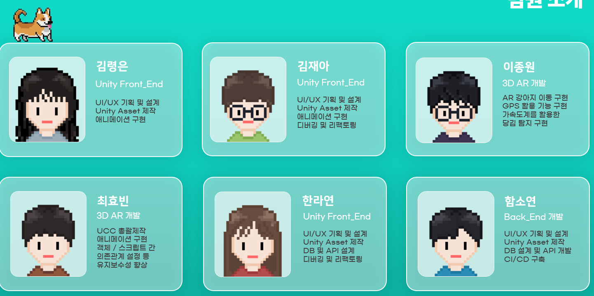
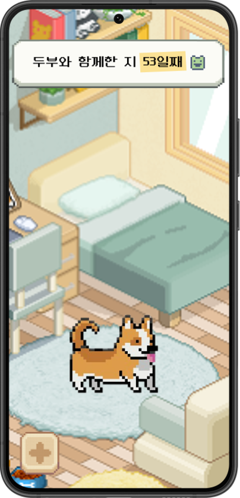
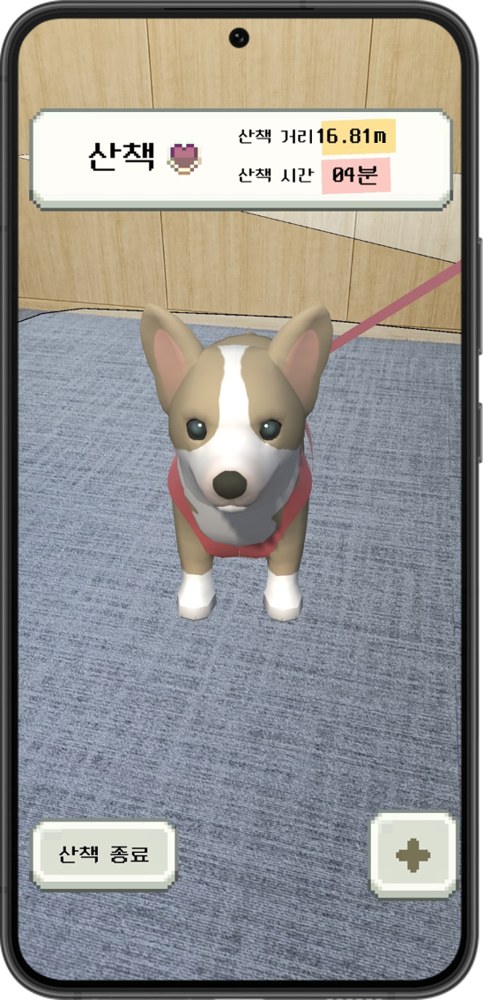
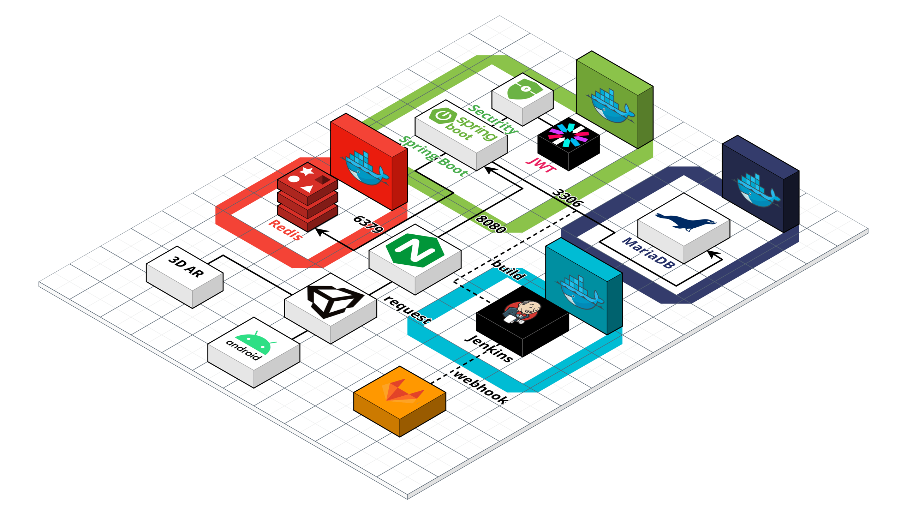
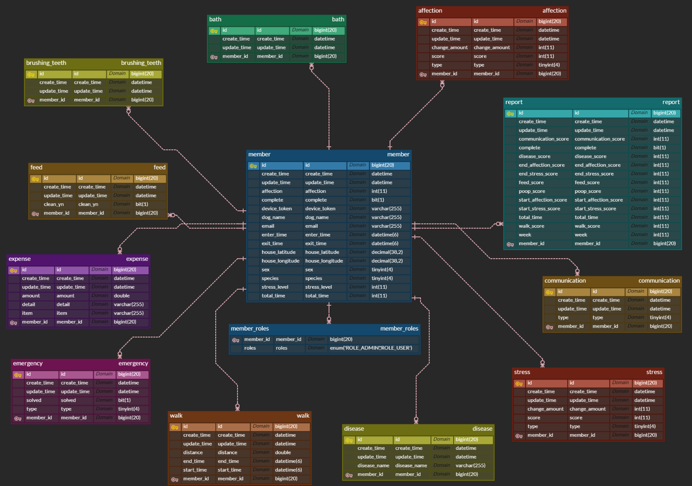

SSAFY 9기 자율 프로젝트

<b>"세상에 나쁜 보호자는 있다"</b>

## :clipboard: 프로젝트 소개
#### 💡 기획 배경
반려동물을 키우는 가정이 늘어나며, 유기되는 동물의 수도 그만큼 늘어나고 있습니다. 
유기동물 보호 및 입양 시스템은 있지만, 유기 동물 발생을 줄일 수 있는 근본적인 해결책은 부족합니다. 
반려동물 양육자의 22.1%가 양육을 포기하거나, 파양을 고민해본 경험이 있다고 합니다.  
반려동물 유기의 가장 큰 원인은 <b>"사람들의 잘못된 지식, 준비되지 않은 자세"</b> 입니다.

#### 📌 개발 목적
모바일 AR, 실시간 알림을 통해
반려견 양육의 현실적인 어려움을 경험하고,  
예비 보호자들의 양육 지식과 성숙한 태도를 확인하는 반려견 시뮬레이터
 

#### 📆 제작 기간 및 인원

제작 기간 : 2023. 10.09 ~ 2023. 11. 17 (7주)  
참여 인원 : 6인

## 🐾 주요 기능
|반려견 시뮬레이터(2D)|AR 산책 모드(3D)|
|:--:|:--:|
|||
|반려견 육성|AR 강아지 생성 및 이동
|강아지 생활패턴에 맞춘 알림 기능|GPS를 활용한 이동 거리 측정
|강아지 관리 리포트|산책 중 돌발 이벤트 발생 (4종류)

## 💻 기술 스택
### Unity

### Backend

### CI/CD

## 시스템 모식도

## ERD

## 기능 명세