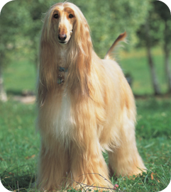

<b>세상에 나쁜 보호자는 있다</b>

"프로젝트를 한 문장으로 표현할 수 있는 문장"

## :clipboard: 개요

## 💡 주요 기능
|반려견 시뮬레이터(2D)|AR 산책 모드(3D)|
|:--:|:--:|
|||
|기능 1|AR 강아지 생성 및 이동
|기능 2|GPS를 활용한 이동 거리 측정
|기능 3|산책 중 돌발 이벤트 발생 (4종류)

## 📆 제작 기간 및 인원

제작 기간 : 2023. 10.09 ~ 2023. 11. 17 (7주)  
참여 인원 : 6인

|||||||
|:--:|:--:|:--:|:--:|:--:|:--:|
|<a href="">김령은</a>|<a href="">김재아</a>|<a href="">한라연</a>|<a href="">함소연</a>|<a href="">이종원</a>|<a href="">최효빈</a>
|Unity|Unity|Unity|Backend|Unity AR|Unity AR|

## 💻 기술 스택
### Unity

### Backend

### CI/CD

## ERD

## 기능 명세서
